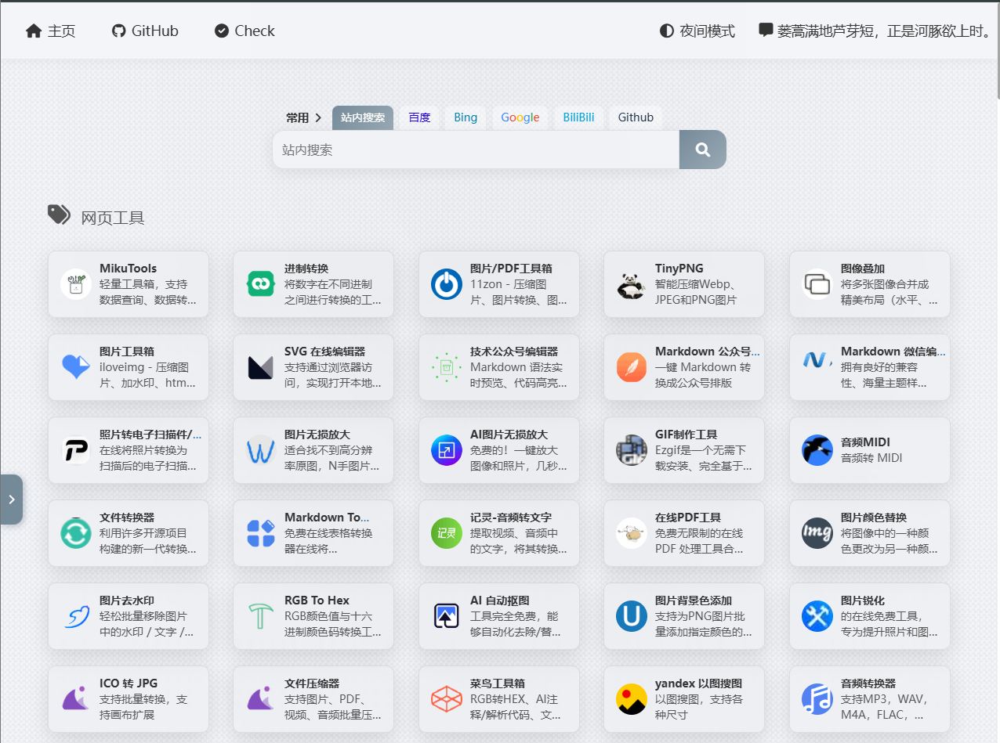

<div align="center">
    <h1>WebNav - A Simple and Efficient Personal Navigation Page</h1>
</div>

<p align="center">
  
</p>


<p align="center">
  <a href="https://github.com/DSTBP/WebNav/stargazers"></a>
  <a href="https://github.com/DSTBP/WebNav/network/members"></a>
  <a href="https://github.com/DSTBP/WebNav/blob/main/LICENSE"></a>
  
</p>

WebNav is a lightweight, responsive personal navigation site template. It helps developers, students, and web enthusiasts efficiently manage, organize, and quickly access frequently used tools and websites. With simple configuration, you can have a personalized browser homepage of your own.

English | [简体中文](README_zh-CN.md)

## ✨ Project Features

- 🚀 **Responsive design**: Built with Bootstrap, perfectly adapts to desktop, tablet, and mobile.
- 🌓 **Dark mode**: One-click switch between dark/light themes for eye comfort and better experience.
- 📂 **Category management**: Easily switch between categories via the sidebar.
- 🔍 **URL checker tool**: Built-in URL checker (`url-checker.html`) to verify link validity.
- ⚡ **Minimal architecture**: Pure static pages with no backend database, lightning-fast loading, deployable on GitHub Pages or Vercel at zero cost.
- 🎨 **Highly customizable**: All navigation data is maintained in local JS files for easy edits.

## 📸 Interface Preview


- Home: displays tiled links for all categories.
- Sidebar: quick jump to category locations.
- Tools page: URL checking feature demo.

## 🚀 Quick Start

### 1. Clone the project
```bash
git clone https://github.com/DSTBP/WebNav.git
cd WebNav
```

### 2. Run locally

Since this project is purely static, you can open `index.html` directly in your browser to see the result.

### 3. Deploy

You can push this repository to GitHub and enable **GitHub Pages** in the repository settings, then visit `https://<your-username>.github.io/WebNav`.

## 🛠 How to Customize Navigation Content

You do not need to modify the HTML structure. All navigation link data is stored in:

```
asserts/js/data.js
```

Just edit the file in the following format:

JavaScript

```js
// Sample data structure
const navData = [
  {
    category: "Common Tools",
    links: [
      { name: "GitHub", url: "https://github.com", icon: "github" },
      { name: "Google", url: "https://google.com", icon: "google" }
    ]
  }
];
```

## 🤝 Community Feedback and Co-building

We warmly welcome community participation. If you have any ideas or suggestions, you can contribute in these ways:

- **Submit an Issue**: Found a bug or have a new feature request? Please [submit here](https://www.google.com/search?q=https://github.com/DSTBP/WebNav/issues).
- **Submit a PR**: If you improved CSS styles or added new features, feel free to open a Pull Request.
- **Feedback channels**: Use GitHub Discussions or comment directly in Issues.

Before contributing code, please ensure your code style stays consistent with the project and run basic local tests.

## 📂 File Structure

```
WebNav/
├── asserts/
│   ├── css/          # Stylesheets (App, Bootstrap, FontAwesome)
│   └── js/           # Core logic and data config (app.js, data.js)
├── images/           # Icons and static assets
├── index.html        # Project homepage
├── url-checker.html  # Link checking tool page
├── LICENSE           # Open-source license
└── README.md         # Project documentation
```

## 📄 License

This project is licensed under the **MIT License**. You are free to use, modify, and distribute it, but please keep the original copyright notice. See the [LICENSE](https://www.google.com/search?q=LICENSE) file for details.

------

**WebNav** - Bringing web navigation back to simplicity.

If this project helps you, please give it a **Star** ⭐, this is the biggest encouragement for me!
